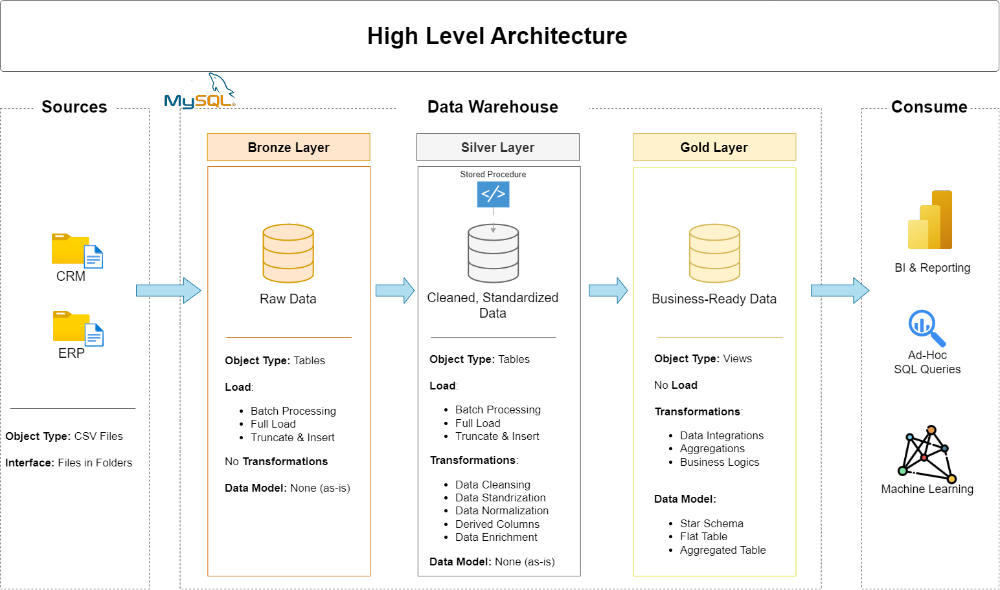
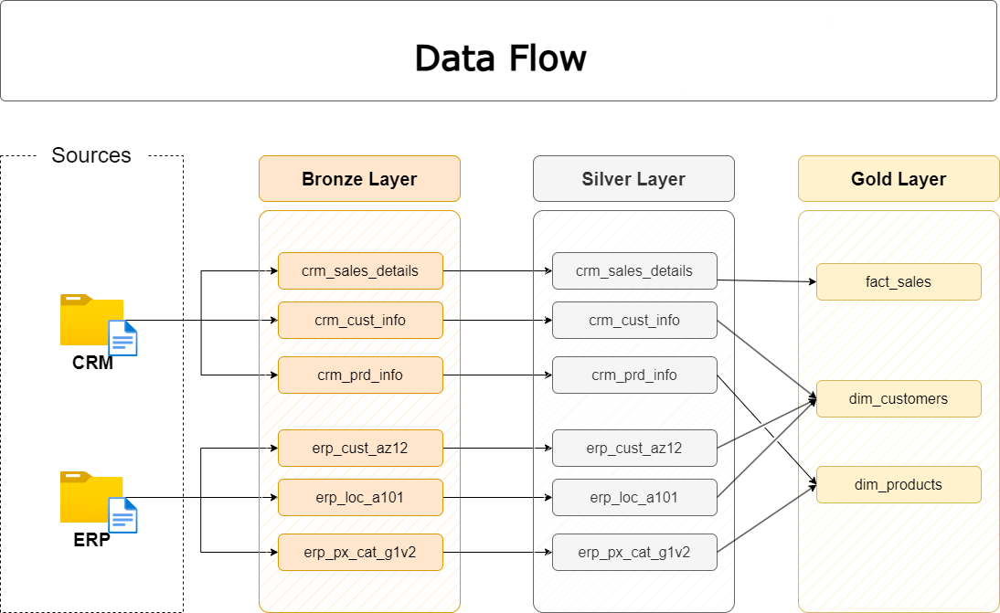
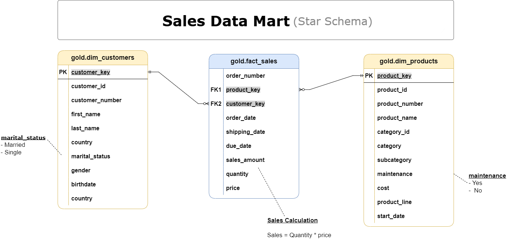

# SQL Data Warehouse Project

> End-to-end Data Warehouse built on Medallion (Bronze–Silver–Gold) architecture with MySQL, star schema modeling, ETL pipelines, and analytics.

---

##  Architecture

The warehouse follows the **Medallion Architecture**, with each layer implemented as a separate MySQL database.

| Layer | Database | Purpose |
|-------|----------|---------|
|  Bronze | `bronze` | Raw ingestion - data loaded as-is from source CSV files |
|  Silver | `silver` | Cleaned, standardized, and normalized data |
|  Gold | `gold` | Business-ready analytical views (Star Schema) |



---

##  Repository Structure
```
├── datasets/
│   ├── source_crm/                  # CRM raw CSV files (customers, products, sales)
│   └── source_erp/                  # ERP raw CSV files (categories, location, demographics)
├── docs/
│   ├── 01_data_architecture.png
│   ├── 02_data_layers.png
│   ├── 03_ETL.png
│   ├── 04_data_integration.png
│   ├── 05_data_flow.png
│   ├── 06_data_model.png
│   ├── 07_data_catalog.md
│   └── 08_naming_conventions.md
├── scripts/
│   ├── 01_init_database.sql         # Creates bronze, silver, gold databases
│   ├── bronze/
│   │   ├── 02_bronze_ddl.sql        # Bronze table definitions
│   │   └── 03_load_bronze.sql       # load raw CSV data
│   ├── silver/
│   │   ├── 04_silver_ddl.sql        # Silver table definitions
│   │   └── 05_load_silver.sql       # Stored procedure: cleanse & transform
│   └── gold/
│       └── 06_gold_ddl.sql          # Gold analytical views (Star Schema)
└── tests/
    ├── quality_checks_silver.sql
    └── quality_checks_gold.sql
```

---

##  Source Data

Data originates from two operational systems:

**CRM**
| File | Description | Rows |
|------|-------------|------|
| `cust_info.csv` | Customer demographics | 18,494 |
| `prd_info.csv` | Product catalog | 397 |
| `sales_details.csv` | Sales transactions | 60,398 |

**ERP**
| File | Description | Rows |
|------|-------------|------|
| `PX_CAT_G1V2.csv` | Product categories | 37 |
| `LOC_A101.csv` | Customer location | 18,484 |
| `CUST_AZ12.csv` | Customer birthdate & gender | 18,484 |

---

##  ETL Pipeline

**Step 1 - Initialize Databases**
```sql
SOURCE scripts/01_init_database.sql;
```
>  Drops existing `bronze`, `silver`, `gold` databases if they exist.

**Step 2 - Bronze Layer (Raw Ingestion)**
```sql
SOURCE scripts/bronze/02_bronze_ddl.sql;
SOURCE scripts/bronze/03_load_bronze.sql;
```
Raw CSV data loaded with no transformations. Source schema preserved exactly.

**Step 3 - Silver Layer (Cleansing & Standardization)**
```sql
SOURCE scripts/04_silver_ddl.sql;
SOURCE scripts/05_load_silver.sql
CALL load_silver();
```
Applies data type casting, duplicate removal, null handling, gender/country standardization, and derived fields.

**Step 4 - Gold Layer (Star Schema Views)**
```sql
SOURCE scripts/06_gold_ddl.sql;
```
Creates `gold.fact_sales`, `gold.dim_customers`, `gold.dim_products` as analytical views.

---

##  Data Flow



| Source | Bronze | Silver | Gold |
|--------|--------|--------|------|
| CRM | crm_sales_details | crm_sales_details | fact_sales |
| CRM | crm_cust_info | crm_cust_info | dim_customers |
| CRM | crm_prd_info | crm_prd_info | dim_products |
| ERP | erp_cust_az12 | erp_cust_az12 | dim_customers |
| ERP | erp_loc_a101 | erp_loc_a101 | dim_customers |
| ERP | erp_px_cat_g1v2 | erp_px_cat_g1v2 | dim_products |

---

##  Data Model (Star Schema)



| Table | Type | Description |
|-------|------|-------------|
| `gold.fact_sales` | Fact | Orders, dates, quantity, price, sales amount |
| `gold.dim_customers` | Dimension | Demographics, gender, marital status, country, birthdate |
| `gold.dim_products` | Dimension | Category, subcategory, product line, cost, maintenance flag |

> `sales_amount = quantity × price`

---

##  Quality Checks
```sql
SOURCE tests/quality_checks_silver.sql;
SOURCE tests/quality_checks_gold.sql;
```

Silver checks: primary key uniqueness, duplicate detection, null validation, standardization correctness.
Gold checks: referential integrity, aggregation accuracy, analytical consistency.

---

##  Naming Conventions

| Object | Pattern | Example |
|--------|---------|---------|
| Bronze / Silver Tables | `<system>_<entity>` | `crm_cust_info` |
| Dimension Tables | `dim_<entity>` | `dim_customers` |
| Fact Tables | `fact_<entity>` | `fact_sales` |
| Surrogate Keys | `<entity>_key` | `customer_key` |
| Technical Columns | `dwh_<name>` | `dwh_load_date` |
| Stored Procedures | `load_<layer>` | `load_bronze` |

Full details in [`naming_conventions.md`](08_naming_conventions.md).

---

##  Tech Stack

| Component | Technology |
|-----------|------------|
| Database | MySQL 8 |
| Architecture | Medallion (Bronze / Silver / Gold) |
| Data Modeling | Star Schema |
| ETL | SQL Stored Procedures |
| BI Compatibility | Power BI / Tableau / Excel |
